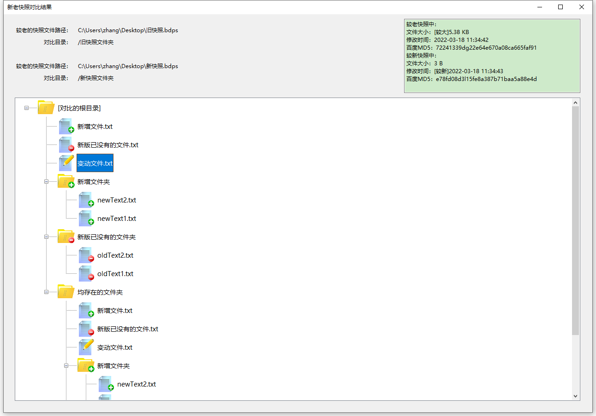

# BaiduPanCompareTools
百度网盘对比工具，可为别人分享的百度网盘链接建立快照，当之后分享者更新了内容，用本工具对比两次分享的文件夹和文件差异，也可与本地磁盘对比

## 开发及运行说明

本工具使用C#编程语言，基于.NET 6.0开发
运行本工具需要在Windows系统中安装.NET 6.0的运行环境，微软官网下载地址为：https://dotnet.microsoft.com/zh-cn/download/dotnet/6.0 ，打开网页后选择下载“.NET 桌面运行时”
安装完运行环境后，双击打开“BaiduPanCompareTools.exe”，即可运行本工具

## 开发本工具的原因

百度网盘是目前互联网上主流的资源分享平台，众多教程、影视、素材资源等网站，将百度网盘作为发布资源的介质。发布者分享的百度网盘链接，往往日后会经常进行资源更新，当更新后，对于下载者来说，找到哪些资源发生了增加、删除或改变，进行增量下载，只能人工用肉眼对比，费时费力，而且无法直接看出文件内容是否发生变动
所以作者决定开发这个工具，来解决这个问题。也希望日后百度网盘官方能重视这样的用户体验方面的痛点，将类似功能集成到自己的产品中

## 反馈交流
QQ群：132108644 

## 安全声明

本工具仅为客户端软件，作者自己没有服务器，所有查看文件夹、文件的请求，均由本工具直接请求百度网盘服务器，故作者也不可能收集任何信息。而且本工具完全开源，使用者可以自行检查代码、编译程序

## 软件功能介绍
主界面图：

提示：界面中所有文件夹或文件的路径输入框，都支持直接拖拽文件夹或文件到上面，然后会自动填充其路径

1. ### 为别人分享的百度网盘链接建立快照，记录本次分享的文件夹和文件信息，以便日后进行对比

- 必须填写百度网盘链接地址和提取码（对于支持自动填充提取码的分享链接无需填写提取码）
- 如果要从打开的百度网盘链接根目录记录快照信息，在“要建立快照的目录”选项输入框中保留默认的“/”即可。若要从更下层的目录开始，则需要向下填写完整的文件夹路径。比如分享的百度网盘链接中有2个文件夹，一个名为“图片”，一个名为“视频”，如果仅想为“视频”文件夹建立快照信息，以便以后对比差异，则填写路径为“/视频”
- 获取指定百度网盘链接中包含的文件夹、文件信息，需要逐级目录去请求百度网盘服务器，如果目录层级较多或者文件个数较多（百度网盘限定一次只能获取100个文件信息，如果一个文件夹下文件个数超过100，需要分多次请求不同的页面包含的文件），要发起请求的次数也会相应增加，建议不要把“打开子文件间隔的时间”设置的太短
- 最下面的选项填写发出请求后，等待百度网盘服务器响应的最长时间，如果超过该时间，程序将中止运行。如果使用者所在的网络环境较差，可适当调大该最长等待时间
- 此功能将填写的百度网盘链接对应的资源信息（含目录层级、文件名、文件MD5等）保存在扩展名为bdps的快照文件中，文件内容实际是json，可用任意文本编辑软件（比如Windows自带的记事本、写字板，常用的办公软件Word、WPS等）打开编辑

2. ### 对比之前的快照与最新的快照，以可视化界面展示文件夹和文件差异

- 必须填写两个快照文件的路径，该功能将对比两次记录的文件夹和文件的差异，以可视化界面进行展示。注意该功能是以文件夹为单位进行对比，而不是只对比网盘中的某个文件
- 该功能以上面填写的较老的快照文件作为比较的模板，只在新快照中有的文件夹或文件认为是新增，反之认为是删除
- “对比哪个目录”选项，同建立快照功能中的“要建立快照的目录”填写方法，如果不是从快照根目录开始对比差异，可以指定从具体哪个子文件夹进行对比

- 在对比结果界面中，以树状目录结构展示有差异的文件夹和文件。点击文件，在右上角的文本框中可以查看新老快照中记录的该文件信息
- 图标说明：

&emsp;&emsp;&emsp;&emsp;：下属有变动的文件夹

&emsp;&emsp;&emsp;&emsp;：新增文件夹（新快照中有，老快照中没有的文件夹）

&emsp;&emsp;&emsp;&emsp;：删除文件夹（老快照中有，新快照中没有的文件夹）

&emsp;&emsp;&emsp;&emsp;：新增文件（新快照中有，老快照中没有的文件）

&emsp;&emsp;&emsp;&emsp;：删除文件（老快照中有，新快照中没有的文件）

&emsp;&emsp;&emsp;&emsp;：变动文件（在新老快照中都存在，但内容发生改变的文件）

3. ### 对比快照文件与本地磁盘目录，以可视化界面展示本地已下载内容与最新分享内容的差异，以便知道应该下载哪些更新的文件夹或文件

- 必须填写快照文件和要与之对比的本地磁盘目录路径，本工具以可视化界面展示快照相对本地磁盘目录的差异，从而让使用者直观地看出需要下载哪些差异文件才能让本地目录与分享者最新分享的内容保持同步。注意该功能是以文件夹为单位进行对比，而不是只对比某个文件
- 该功能以本地磁盘目录作为比较的模板，只在快照中有的文件夹或文件认为是新增，反之认为是删除
- “对比哪个目录”选项，同建立快照功能中的“要建立快照的目录”填写方法，如果不是从快照根目录开始对比差异，可以指定从具体哪个子文件夹进行对比
- 文件对比是通过MD5值，所以需要对本地文件进行MD5计算，以便与百度网盘中记录的文件MD5对比。计算MD5比较耗时，所以提供了对满足条件的文件忽略计算MD5的选项，如果使用者能自行保证一些文件没有被分享者修改，可以进行设置。目前提供了根据大小或文件扩展名进行忽略的选项

- 在对比结果界面中，以树状目录结构展示有差异的文件夹和文件。点击文件，在右上角的文本框中可以查看本地文件和快照中记录的该文件信息
- 图标说明：

&emsp;&emsp;&emsp;&emsp;：下属有变动的文件夹

&emsp;&emsp;&emsp;&emsp;：新增文件夹（快照中有，本地磁盘目录中没有的文件夹）

&emsp;&emsp;&emsp;&emsp;：删除文件夹（本地磁盘目录中有，快照中没有的文件夹）

&emsp;&emsp;&emsp;&emsp;：新增文件（快照中有，本地磁盘目录中没有的文件）

&emsp;&emsp;&emsp;&emsp;：删除文件（本地磁盘目录中有，快照中没有的文件）

&emsp;&emsp;&emsp;&emsp;：变动文件（在快照和本地磁盘目录中都存在，但内容发生改变的文件）

## 赞助

如果您觉得软件还不错，并且愿意请作者喝杯咖啡的话，欢迎打赏

